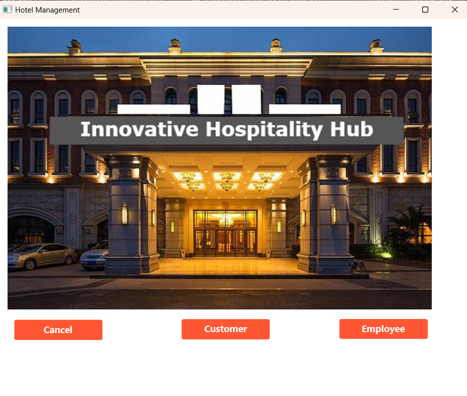
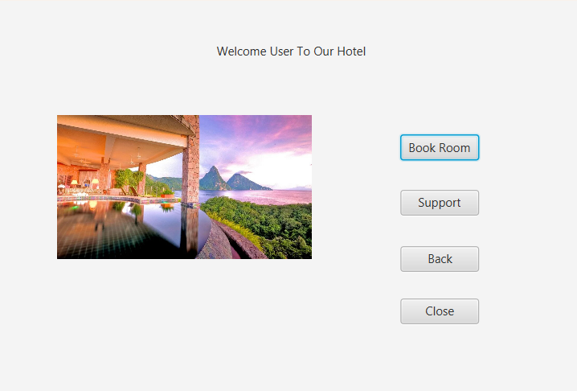
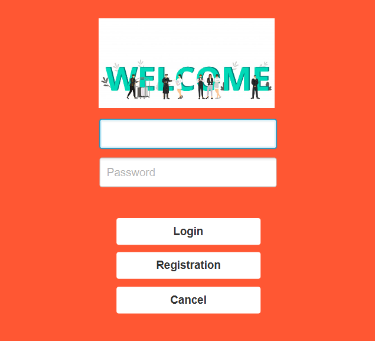
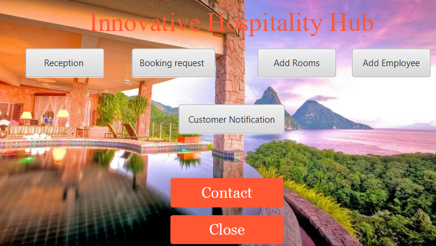

# Innovative Hospitality Hub

Welcome to the Innovative Hospitality Hub, a comprehensive Java project developed for my undergraduate advanced object-oriented programming laboratory. This project leverages Java for the backend, JavaFX for the frontend, and MySQL for the database, creating a versatile hotel management system. Whether you're a customer or an employee, our interface provides an intuitive way to interact with various hotel functions.

## Table of Contents
- [Contributors](#contributors)
- [Tools Used](#tools-used)
- [Features](#features)
- [Getting Started](#getting-started)
- [Usage](#usage)
- [Project Visualization](#project-visualization)
- [Contact](#contact)

## Contributors 👥

- **Mohaimenul Azam Khan Raiaan 🧑‍💼 (Team Lead)**  
  [GitHub](https://github.com/mak-raiaan)

- **Nur Mohammad Fahad**  
  [GitHub](https://github.com/FahadUIU)

- **Shovan Chowdhury**  
  [GitHub](https://github.com/shovanch)

## Tools Used 🛠️

- Java (Backend)
- JavaFX (Frontend)
- MySQL (Database)

## Features 🏨

### Customer Interface
- 🛏️ **Book Room**: Reserve a room by providing your personal information.
- 🆘 **Support**: Contact an employee for assistance.
- ↩️ **Back**: Return to the home page.
- 🚪 **Close**: Exit the application.

### Welcome Interface
- 👤 **Login**: Log in with your username and password.
- 📝 **Register New Employees**: Register new employees.
- ❌ **Cancel**: Quit the application.

### Innovative Hospitality Interface (Employee Interface)
- 🛎️ **Reception**: Access employee features.
- 📅 **Booking Request**: Review and manage customer bookings.
- ➕ **Add Employee**: Add new employees to the system.
- ➕ **Add Rooms**: Add new rooms to the hotel.
- 📬 **Customer Notifications**: View messages from customers.
- 🚪 **Close**: Exit the application.

### Reception Interface
- ➕ **Add New Customer**: Add a new customer to the system.
- 🏨 **Room**: View room availability, clean status, price, and bed type.
- 👥 **All Employee Info**: Access information about all employees.
- 🧑‍🤝‍🧑 **Customer Info**: Access information about all customers.
- 🕴️ **Manager Info**: View information about the manager.
- 📋 **Check Out**: Check out a customer.
- 🔄 **Update Check Status**: Update a customer's check-in status.
- 🔄 **Update Room Status**: Update a room's status.
- 🏢 **Department**: View the status of various hotel departments.

## Getting Started 🚀

To get started with our Innovative Hospitality Hub, follow these steps:

1. Clone this repository to your local machine.
2. Set up your MySQL database and update the database configuration in the code as needed.
3. Open the project in your preferred Java IDE.
4. Run the application and explore its features.

## Usage 📦

Follow the prompts in the application to navigate through the various interfaces and utilize the features of the Innovative Hospitality Hub.

## Project Visualization 🌆

<figure style="text-align: center;">
  
  <figcaption style="color: #1E90FF;">Home Page</figcaption>
</figure>

<figure style="text-align: center;">
  
  <figcaption style="color: #1E90FF;">Customer Dashboard</figcaption>
</figure>

<figure style="text-align: center;">
  
  <figcaption style="color: #1E90FF;">Login Page for Employee</figcaption>
</figure>

<figure style="text-align: center;">
  
  <figcaption style="color: #1E90FF;">Employee Dashboard</figcaption>
</figure>

## Contact 📧

For inquiries and support, please contact Mohaimenul Azam Khan Raiaan at [m.raiaan.cs@gmail.com](mailto:m.raiaan.cs@gmail.com).
